# 🌌 Substrate Logistics: Cosmological Engine & Observatory

[](https://substrate-logistics.streamlit.app/)
[](https://github.com/LoopBreacher/substrate_logistics_cosmological_dashboard)
[](https://orcid.org/0009-0003-8413-6027)
[](https://www.python.org/)
[](LICENSE)

An interactive, first-principles cosmological simulation engine and observatory. **Substrate Logistics** replaces empirical curve-fitting parameters (Dark Energy $\Omega_\Lambda$, Cold Dark Matter halos, and FLRW single-scalar constraints) with a zero-parameter metric unspooling framework driven directly by 3D compiled matter density fields $\rho_N(\vec{r})$ across real astronomical catalogs (UNG 2013, Cosmicflows-4, 2M++).

---

## 📖 Key Highlight: Resolving the Hubble Tension

Before exploring the individual modules, read our **[Comparative Architecture Guide](documentation/Comparative%20Architecture%20Guide.md)**. It provides a detailed theoretical comparison between $\Lambda\text{CDM}$ and Substrate Logistics, demonstrating why local $H_0 \approx 73\text{ km/s/Mpc}$ measurements and CMB $H_0 = 67.42\text{ km/s/Mpc}$ observations reflect two distinct, physically valid regimes rather than an observational crisis.

---

## ⚙️ Physical Invariants & Anchor Constants

| Parameter | Symbol | Value | Units / Description |
| :--- | :--- | :--- | :--- |
| **Global Vacuum Floor** | $H_{\text{global}}$ | `67.42` | $\text{km/s/Mpc}$ |
| **Substrate Anchor Constant** | $\mathcal{K}_\Omega$ | `1.11587e-37` | $\text{m}^3 / (\text{node}\cdot\text{s}^2)$ |
| **Universal Attenuation Tensor** | $\mathcal{T}_\Omega$ | `1.30147e19` | dimensionless Tensor |
| **Mass per Integer Node** | $m_p$ | `1.67262e-27` | $\text{kg}$ (Proton mass baseline) |
| **BAO Natural Ruler** | $r_s$ | `149.21` | $\text{Mpc}$ (First-principles acoustic scale) |

---

## 🚀 Quickstart & Installation

```bash
# Clone the repository
git clone https://github.com/LoopBreacher/substrate_logistics_cosmological_dashboard.git
cd substrate_logistics_cosmological_dashboard

# Create and activate a virtual environment
python -m venv venv
source venv/bin/activate
# On Windows: venv\Scripts\activate

# Install dependencies
pip install -r requirements.txt

# Launch the Streamlit dashboard
streamlit run app.py
```

---

## 🔬 Observatory Modules & Domain Breakdown

### Domain 1: Distances & $H_0$ Tension
Focuses on line-of-sight ray tracing, directional anisotropy, and zero-parameter supernova calibration.

| Module | Visual Diagnostic Preview | Physical Principle & Highlights | Detailed Docs |
| :--- | :--- | :--- | :--- |
| **Sky Anisotropy Maps** | 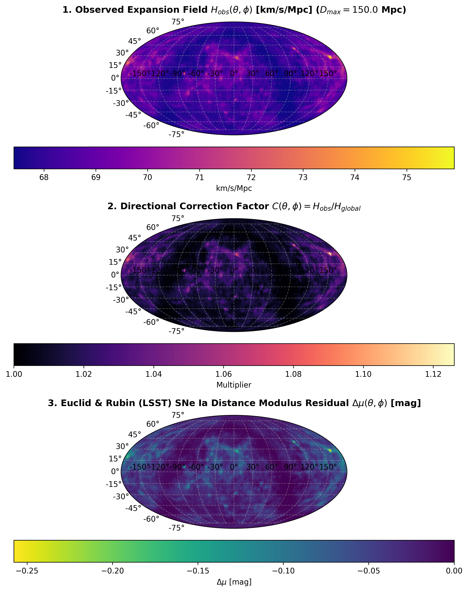 | Full-sky $H_0(\hat{n})$ unspooling maps and Euclid/LSST distance modulus anomaly forecasts $\Delta \mu(\hat{n})$. | [Read Documentation](documentation/readme_substrate_directional_correction_field.md) |
| **Line-of-Sight Kinematics** | 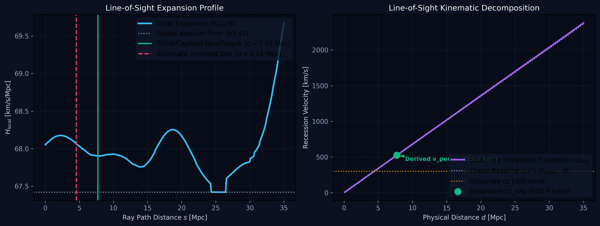 | Decouples pure cosmological expansion ($cz_{\text{exp}}$) from peculiar velocity ($v_{\text{pec}}$) along TRGB/Cepheid target paths. | [Read Documentation](documentation/readme_line_of_sight_kinematics.md) |
| **Redshift Path Integral** | 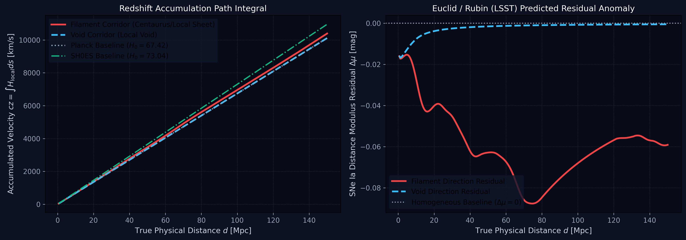 | Integrates redshift accumulation through dense filament corridors versus empty void sightlines. | [Read Documentation](documentation/readme_redshift_path_integral.md) |
| **Supernova Fit ($\Omega_\Lambda = 0$)** | 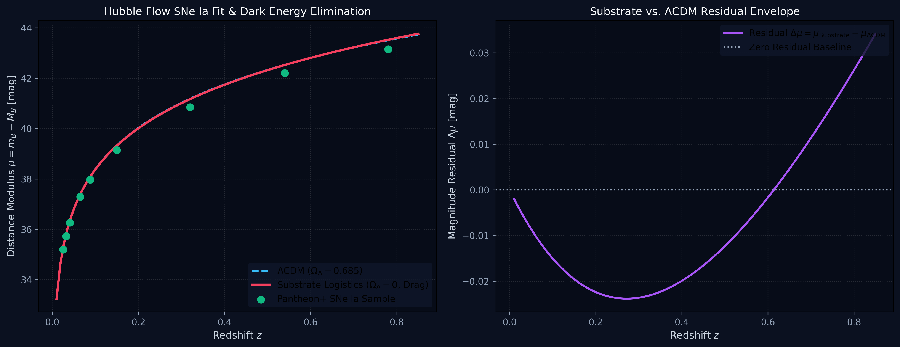 | Eliminates Dark Energy ($\Omega_\Lambda = 0$), reproducing Pantheon+ high-<i>z</i> dimming via photon memory drag attenuation. | [Read Documentation](documentation/readme_substrate_hubble_diagram_fitter.md) |
| **KBC Supervoid Profile** | 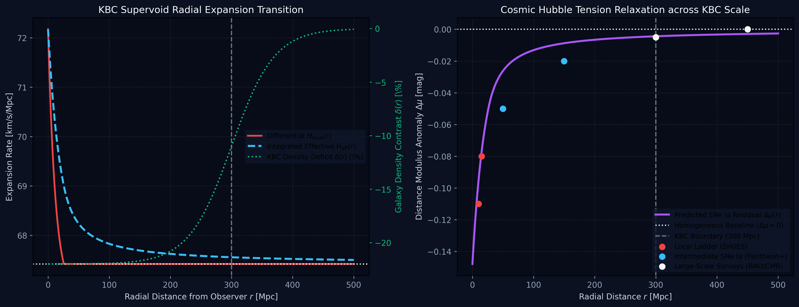 | Models radial expansion relaxation from local filament cores ($73\text{ km/s/Mpc}$) down to the global floor ($67.42\text{ km/s/Mpc}$). | [Read Documentation](documentation/readme_substrate_kbc_void_profile.md) |

---

### Domain 2: Cosmic Web & Velocity Dynamics
Focuses on spatial velocity gradients, void wall dynamics, 2D RSD correlations, rotation curves, and 3D web rendering.

| Module | Visual Diagnostic Preview | Physical Principle & Highlights | Detailed Docs |
| :--- | :--- | :--- | :--- |
| **Bulk Flow Field** | 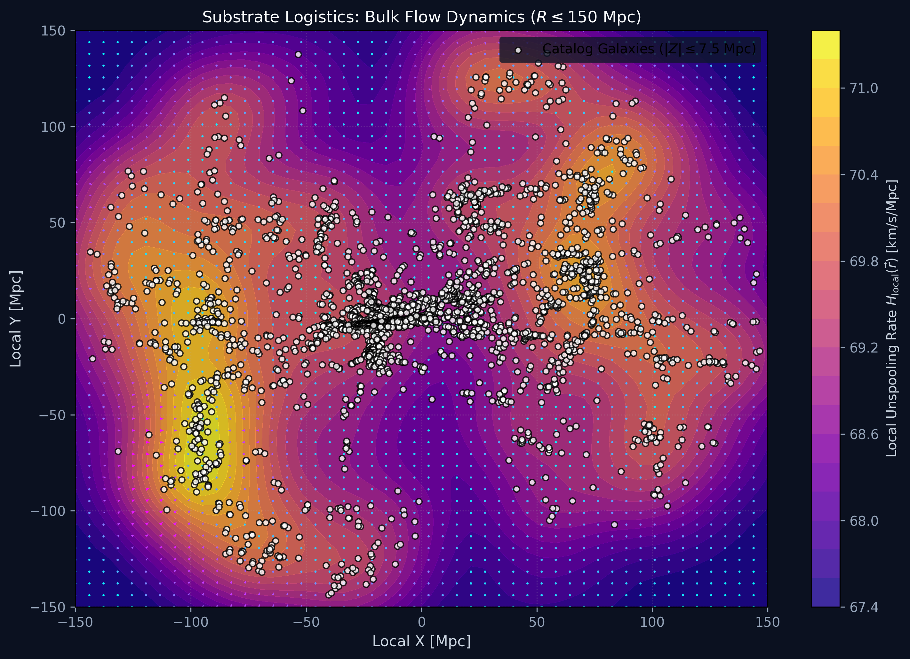 | Maps 2D spatial vector fields driven by expansion gradients $\vec{v}_{\text{inflow}} = \alpha \nabla H_{\text{local}}(\vec{r})$. | [Read Documentation](documentation/readme_substrate_bulk_flow_field.md) |
| **Void Boundary Dynamics** | 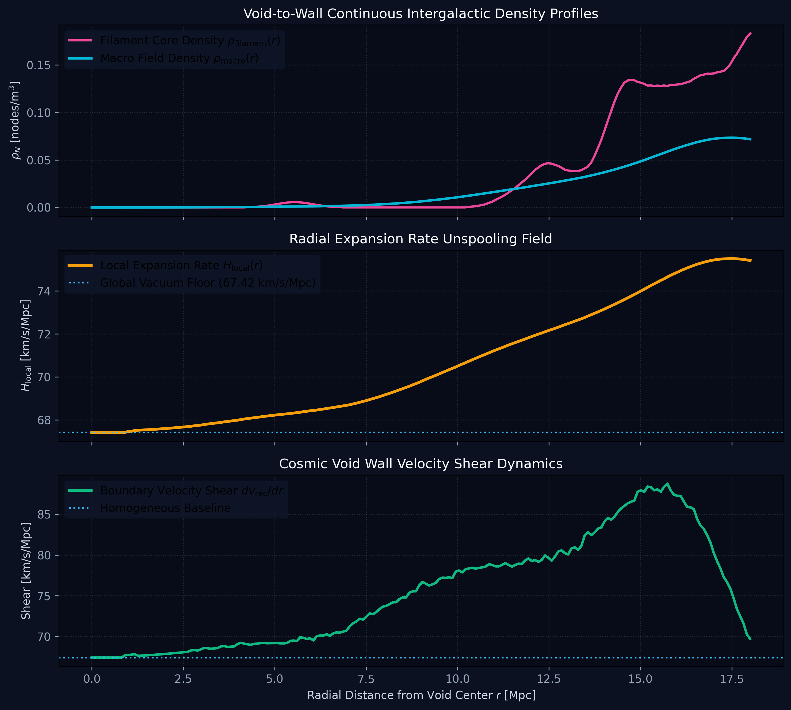 | Evaluates vacuum floor locking in void cores and velocity shear spikes ($dv_{\text{rec}}/dr$) across wall corridors. | [Read Documentation](documentation/readme_substrate_void_boundary_dynamics.md) |
| **Redshift Space Distortions** | 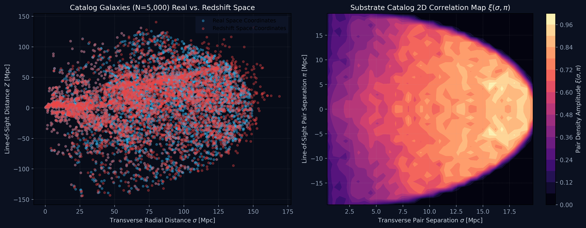 | Zero-parameter simultaneous extraction of Kaiser coherent squashing and cluster-core Fingers-of-God (FoG) elongation. | [Read Documentation](documentation/readme_substrate_redshift_space_distortions.md) |
| **Galactic Rotation Curves** | 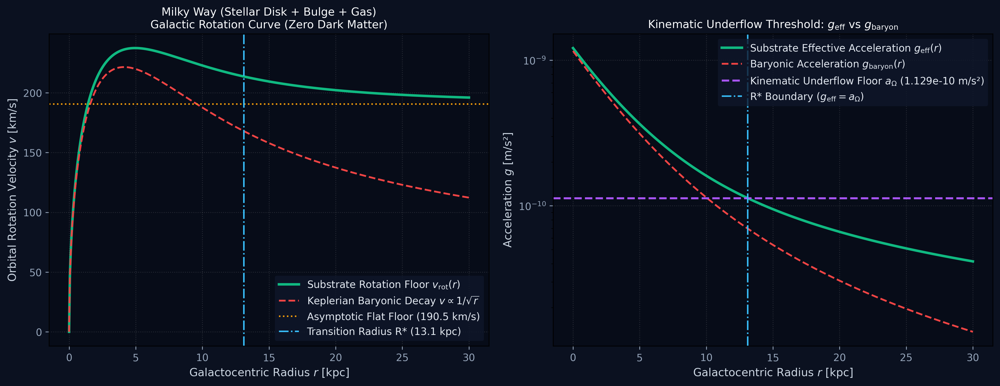 | Eradicates Dark Matter halos; flat rotation speeds lock onto the Kinematic Underflow floor $v_{\text{flat}} = \sqrt[4]{G M_B a_\Omega}$. | [Read Documentation](documentation/readme_substrate_rotation_curves.md) |
| **3D Cosmic Web Viewer** | 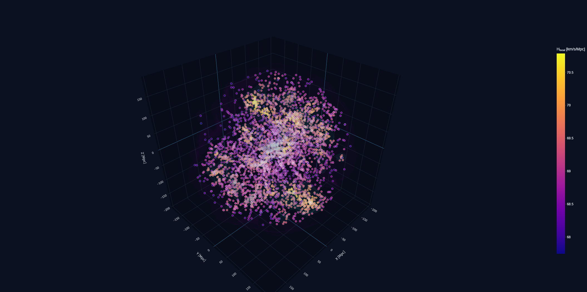 | Interactive Plotly 3D Cartesian rendering of active survey galaxies and volumetric filament web isosurfaces. | [Read Documentation](documentation/readme_substrate_3d_density_viewer.md) |

---

### Domain 3: Astrophysical & Horizon Tests
Focuses on bare-metal geometric rulers, hybrid CMB dipole shifts, and optical light deflection.

| Module | Visual Diagnostic Preview | Physical Principle & Highlights | Detailed Docs |
| :--- | :--- | :--- | :--- |
| **BAO Ruler Warping** | 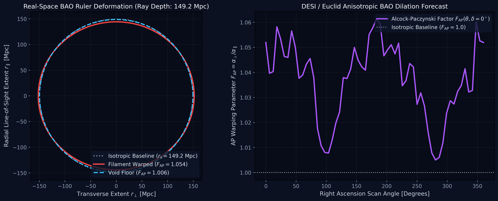 | Alcock-Paczynski anisotropic distortion of the $149.21\text{ Mpc}$ acoustic sphere across local filament structures. | [Read Documentation](documentation/readme_substrate_bao_ruler_warping.md) |
| **CMB Dipole Anomaly** | 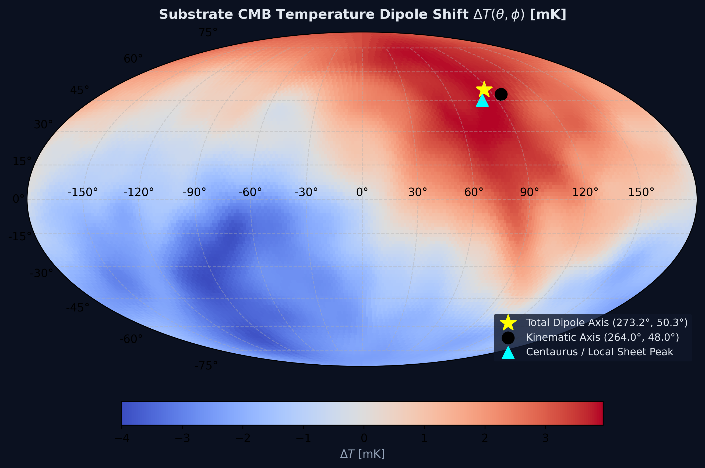 | Hybrid Solar motion + line-of-sight redshifting vector sum, shifting the observable dipole axis toward Centaurus. | [Read Documentation](documentation/readme_substrate_cmb_dipole_anomaly.md) |
| **Gravitational Lensing** | 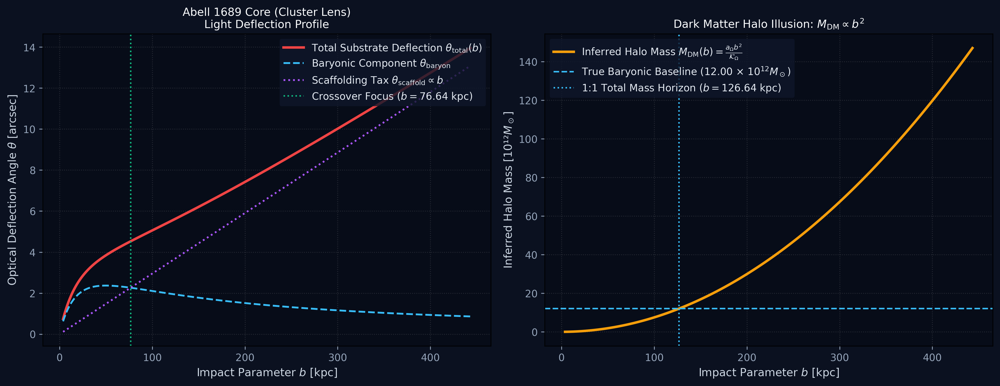 | Zero-dark-matter light deflection separating $1/b$ baryonic address deletion from the linear unspooling tax $4 a_\Omega b / c^2$. | [Read Documentation](documentation/readme_substrate_galactic_lensing.md) |

---

### Domain 4: Master Regulatory Protocol & Bandwidth Allocation
Focuses on spatial memory management, coordinate deletion rates, and hardware clock throttling.

| Module | Visual Diagnostic Preview | Physical Principle & Highlights | Detailed Docs |
| :--- | :--- | :--- | :--- |
| **Spatial Garbage Collection** | 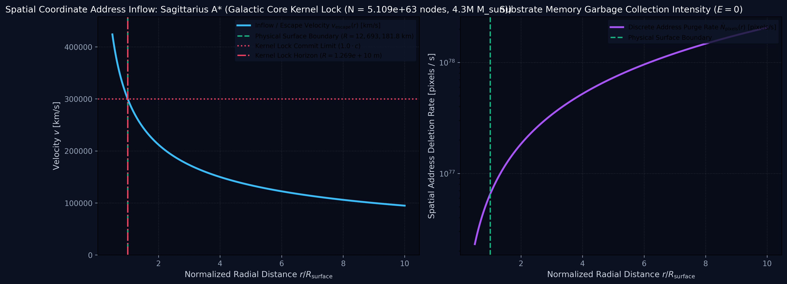 | Reclassifies gravity as $E=0$ spatial address deletion ($\dot{N}_{\text{pixels}}$), deriving escape velocity as coordinate inflow speed. | [Read Documentation](documentation/readme_spatial_garbage_collection_engine.md) |
| **CPU Bandwidth Throttling** | 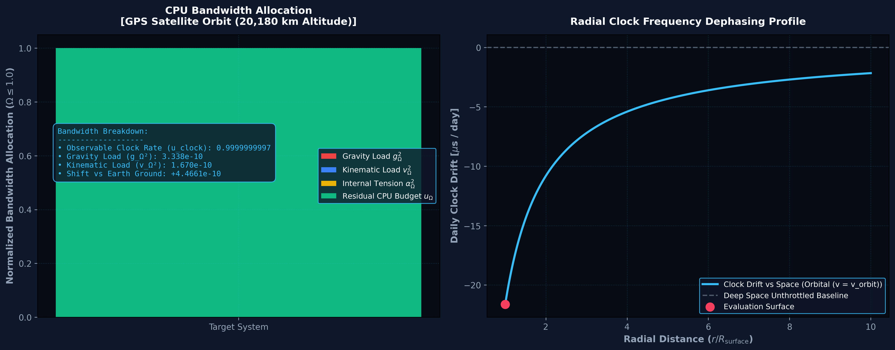 | Explains gravitational time dilation as metric processing latency under the Pythagorean bandwidth invariant ($c^2 = v^2 + u^2$). | [Read Documentation](documentation/readme_cpu_bandwidth_throttling.md) |

---

## 👤 Author & Citation

**Marco Lindenbeck**  
ORCID: [0009-0003-8413-6027](https://orcid.org/0009-0003-8413-6027)  
Repository: [LoopBreacher/substrate_logistics_cosmological_dashboard](https://github.com/LoopBreacher/substrate_logistics_cosmological_dashboard)

If you use this software or framework in your research, please cite:

```bibtex
@software{lindenbeck2026substrate,
  author    = {Lindenbeck, Marco},
  title     = {Substrate Logistics: Cosmological Engine \& Observatory},
  year      = {2026},
  publisher = {GitHub},
  url       = {https://github.com/LoopBreacher/substrate_logistics_cosmological_dashboard}
}
```

---

## 📜 License

This project is licensed under the MIT License - see the [LICENSE](LICENSE) file for details.
